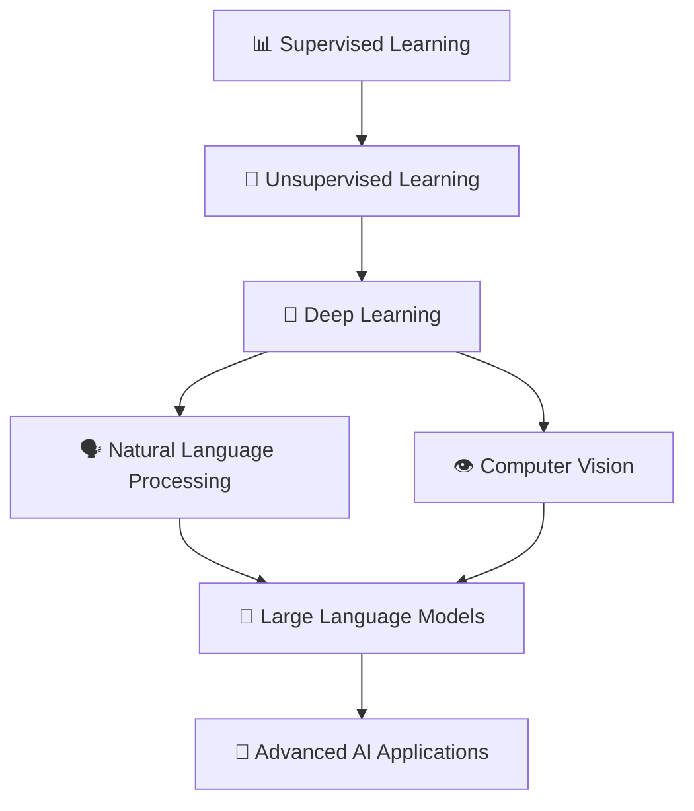

# 🚀 MachineLearning101: Your Complete ML Journey

<div align="center">


*From Zero to ML Hero - A comprehensive hands-on journey through Machine Learning, Deep Learning, NLP, Computer Vision, and beyond!*

</div>

## 🎯 What You'll Master

This repository is your **one-stop destination** for mastering machine learning from the ground up. We're building a comprehensive collection of practical notebooks that take you from basic concepts to cutting-edge AI applications.

### 🗺️ Learning Roadmap



## 📚 Current & Upcoming Content

### ✅ **Available Now**
- **📈 Linear Regression with MSE & Gradient Descent** - Master the fundamentals with hands-on implementation using real housing data

### 🔄 **Coming Soon**
- **Supervised Learning Suite**
  - Logistic Regression & Classification
  - Decision Trees & Random Forests
  - Support Vector Machines
  - Ensemble Methods & Boosting

- **Unsupervised Learning Adventures**
  - K-Means & Hierarchical Clustering
  - Principal Component Analysis (PCA)
  - t-SNE & UMAP for Dimensionality Reduction
  - Anomaly Detection Techniques

- **Deep Learning Mastery**
  - Neural Networks from Scratch
  - Convolutional Neural Networks (CNNs)
  - Recurrent Neural Networks (RNNs & LSTMs)
  - Transformer Architectures

- **Natural Language Processing**
  - Text Preprocessing & Feature Engineering
  - Sentiment Analysis & Classification
  - Named Entity Recognition
  - Topic Modeling & Document Similarity
  - Transformer-based Models (BERT, GPT)

- **Computer Vision Excellence**
  - Image Classification & Object Detection
  - Image Segmentation & Style Transfer
  - Generative Adversarial Networks (GANs)
  - Vision Transformers (ViTs)

- **Large Language Models & Beyond**
  - Fine-tuning Pre-trained Models
  - Retrieval-Augmented Generation (RAG)
  - Prompt Engineering & Chain-of-Thought
  - Multi-modal AI Applications

## 🛠️ Tech Stack

- **Core**: Python 3.8+, Jupyter Notebooks
- **ML Libraries**: scikit-learn, pandas, numpy
- **Deep Learning**: TensorFlow, PyTorch, Keras
- **NLP**: transformers, spaCy, nltk
- **Computer Vision**: OpenCV, PIL, torchvision
- **Visualization**: matplotlib, seaborn, plotly

## 🚀 Quick Start

### Prerequisites
```bash
# Make sure you have Python 3.8+ installed
python --version
```

### Installation
```bash
# Clone the repository
git clone https://github.com/Harry-231/MachineLearning101.git
cd MachineLearning101

# Install dependencies
pip install -r requirements.txt

# Launch Jupyter Notebook
jupyter notebook
```

### Your First Steps
1. Start with `regression/Supervised_learning.ipynb` to understand the fundamentals
2. Follow along with the interactive code examples
3. Experiment with different parameters and datasets
4. Check out the `data/` folder for practice datasets

## 📖 Learning Philosophy

**🎯 Hands-On First**: Every concept is accompanied by practical, runnable code
**📊 Real Data**: Work with actual datasets to solve real-world problems  
**🔍 Deep Dive**: Understand not just the "how" but the "why" behind each algorithm
**🚀 Progressive**: Build complexity gradually from basics to advanced topics
**🤝 Community**: Learn together, contribute, and grow as a ML practitioner

## 🗂️ Repository Structure

```
MachineLearning101/
├── 📁 regression/
│   ├── Supervised_learning.ipynb
│   └── USA_Housing.csv
├── 📁 classification/          # Coming Soon
├── 📁 clustering/             # Coming Soon
├── 📁 deep_learning/          # Coming Soon
├── 📁 nlp/                    # Coming Soon
├── 📁 computer_vision/        # Coming Soon
├── 📁 llm/                    # Coming Soon
├── 📁 datasets/
├── 📁 utils/
├── requirements.txt
├── LICENSE
└── README.md
```

## 🎓 Perfect For

- **🆕 Beginners** starting their ML journey
- **🎓 Students** looking for practical implementations
- **👩‍💻 Developers** transitioning into AI/ML
- **📊 Data Scientists** wanting to refresh fundamentals
- **🔬 Researchers** seeking implementation references

## 🤝 Contributing

We believe in learning together! Here's how you can contribute:

- **🐛 Found a bug?** Open an issue
- **💡 Have an idea?** Share it in discussions  
- **📝 Want to add content?** Submit a pull request
- **❓ Questions?** Don't hesitate to ask

### Contribution Guidelines
1. Fork the repository
2. Create a feature branch (`git checkout -b feature/AmazingFeature`)
3. Commit your changes (`git commit -m 'Add some AmazingFeature'`)
4. Push to the branch (`git push origin feature/AmazingFeature`)
5. Open a Pull Request

## 🌟 Why This Repository?

- **📚 Comprehensive**: Complete learning path from basics to advanced
- **💻 Practical**: Every concept with hands-on implementation
- **🔄 Updated**: Regularly updated with latest techniques and best practices  
- **🎯 Focused**: Clear, concise explanations without unnecessary complexity
- **🌐 Community-Driven**: Built by learners, for learners

## 📈 Learning Progress Tracker

Track your journey through our ML curriculum:

- [ ] Linear Regression Fundamentals
- [ ] Classification Algorithms
- [ ] Clustering & Unsupervised Learning
- [ ] Neural Networks Basics
- [ ] Deep Learning Architectures
- [ ] NLP Fundamentals
- [ ] Computer Vision Basics
- [ ] Advanced AI Applications

## 🙏 Acknowledgments

This repository is inspired by the amazing ML community and countless learners who believe in open education. Special thanks to all contributors who help make this resource better!

## 📞 Connect & Support

- **⭐ Star this repo** if you find it helpful
- **🍴 Fork it** to contribute
- **📢 Share it** with fellow learners
- **💬 Join discussions** for Q&A and collaboration

---

<div align="center">

**Ready to start your ML journey? Dive into the notebooks and let's build something amazing together! 🚀**

*Happy Learning! 🎓*

</div>